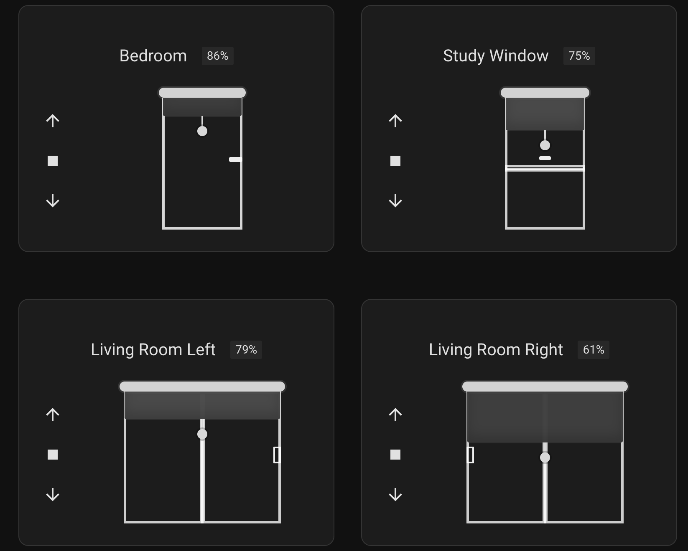
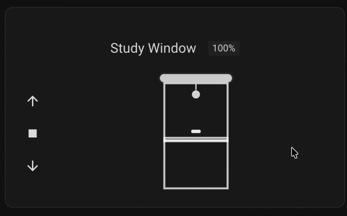

# Lovelace Blind Card Enhanced


A modern, highly visual blind control card for Home Assistant.



This is a fork of the original Blind Card by [tungmeister](https://github.com/tungmeister/hass-blind-card), extended with improved visuals, drag control, and additional configuration options.



---

## Features

- Drag-to-set blind position (with live % preview)
- Smooth, physically accurate blind animation
- Optional pull cord interaction
- Multiple visual styles (door, split window, sliding, roller)
- Invert position and/or commands
- Custom blind and pull colours
- Button + drag control combined

---

## Configuration

### General

| Name | Required | Description |
|------|----------|-------------|
| type | Yes | Must be `custom:lovelace-blind-card-enhanced` |
| title | No | Title of the card |

---

### Entities

| Name | Required | Default | Description |
|------|----------|--------|-------------|
| entity | Yes | - | Cover entity ID |
| name | No | Friendly name | Display name |
| buttons_position | No | left | `left` or `right` |
| title_position | No | top | `top` or `bottom` |
| invert_percentage | No | false | Invert % logic |
| invert_commands | No | false | Flip up/down buttons |
| blind_color | No | #4a4a4a | Blind color |
| pull_color | No | #d8d8d8 | Pull cord color |
| style | No | roller | Visual style |
| show_pull | No | true | Show pull cord |

---

## Styles

- roller  
- door  
- split_window  
- sliding_left  
- sliding_right  
Use the `style` option per entity to change the visual representation.
---

## Example

```yaml
type: custom:lovelace-blind-card-enhanced
title: Blinds
entities:
  - entity: cover.study_blind
    name: Study
    style: door
    blind_color: "#3f3f3f"
    pull_color: "#d8d8d8"

  - entity: cover.lounge_left_blind
    name: Lounge Left
    style: sliding_left

  - entity: cover.lounge_right_blind
    name: Lounge Right
    style: sliding_right
```

---

## Installation

### HACS

1. Add this repository as a custom repository  
2. Install **Lovelace Blind Card Enhanced**  
3. Restart Home Assistant  

---

### Manual

1. Copy `lovelace-blind-card-enhanced.js` into:

/config/www/

2. Add to Lovelace resources:

```yaml
resources:
  - url: /local/lovelace-blind-card-enhanced.js
    type: module
```

---

## Attribution

This project is based on:  
https://github.com/tungmeister/hass-blind-card  

Original concept and base implementation by **tungmeister**.

---

## License

Apache-2.0 (same as original)
